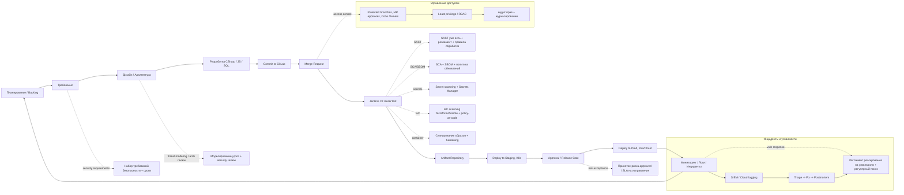

# Оценка процессов безопасной разработки (Компания X) по ГОСТ Р 56939‑2024, BSIMM, DSOMM

## Краткое резюме (анализ соответствия практикам, риски и проблемы)

### Исходные данные (контекст)
Постараемся выжать по максимуму из имеющихся сведений 

- В компании выделен один специалист по безопасной разработке** занимающийся организацией процессов. Исходя из этого можно предположить, что это DevSecOps, а не AppSec. В контексте не сказано про количество нагрузки на данного сотрудника, что тоже влияет прямо на безопасность продуктов.
- Регламентация процессов безопасной разработки **отсутствует** на корню.
- Компания не разрабатывает ГИС и не разрабатывает ПО для КИИ, что существенно снижает регуляторное давление и обязательное выполнение комплекса мер по обеспечению безопасной разработки необходимое для аттестации.
- Технологии: C# / JS / SQL, контейнеризация Docker/Kubernetes, VCS GitLab, CI/CD Jenkins, облако AWS/Azure, IaC Terraform/Ansible.
- Внедрён SAST но не используется в полном объёме.
- Дефекты безопасности попадают в техдолг и приоритезируются по критичности, но без сроков исправления (Отсутствуют SLA на выполнение требований, а также контроль их исполнения).

## Анализ 

### Что выполнено чтоб приблизиться к соответствию практикам и ГОСТу:

- ==Внедрен SAST==: это покрывает часть требований связанных с статическим анализом кода но отсутствие регламентов правильно построенных процессов, метрик порогов  «security gates» и SLA сводят на минимум эффект который она должна приносить.
- ==В оргструктуре присутствует специалист== по безопасной разработке: можно быстро запустить управление практиками  и внедрение «поточных» проверок.
- Как плюс в организации ==используется Iac и CI/CD  удобная база для автоматизации== (security-as-code), если её правильно «обвязать» политиками
-

### Основные пробелы в процессах и связанные риски с ними

### 1) Отсутствуют регламенты и формализованные процессы безопасной разработки

**Описание проблемы:**  
В компании полностью отсутствует регламентация процессов безопасной разработки. Не определены формальные процедуры выполнения ключемых активностей: нет утвержденных порядков проведения статического анализа, управления требованиями безопасности, обработки найденных дефектов, контроля доступа к исходному коду. Процессы выполняются "как сложилось", опираясь на личную инициативу специалиста по безопасной разработке, а не на формальные правила.

**Риски:**
1. **Зависимость от человеческого фактора:** Безопасность "держится на людях", а не на процессах. При уходе ключевого сотрудника или росте команды накопленные практики будут утеряны.
2. **Непредсказуемость результатов:** Невозможно гарантировать, что одинаковые проверки будут выполняться одинаково для разных продуктов или в разных релизах.
3. **Отсутствие базы для улучшений:** Без формализованных процессов невозможно измерять их эффективность и целенаправленно улучшать.
4. **Полное несоответствие ГОСТ:** Отсутствие регламентов делает невозможным выполнение практически любого требования стандарта.

---

### 2) Дефекты безопасности уходят в технический долг без определения сроков исправления (отсутствие SLA)

**Описание проблемы:**  
В компании принята практика включать все найденные дефекты безопасности в технический долг с приоритезацией по критичности. Однако при этом полностью отсутствуют какие-либо сроки исправления (SLA) для дефектов разного уровня критичности. Критические уязвимости могут находиться в техдолге неопределенно долгое время и попадать в релизы продукта без исправления.

**Риски:**
1. **Накопление критических уязвимостей:** Отсутствие сроков приводит к тому, что исправление откладывается "на потом", которое никогда не наступает из-за приоритетов бизнес-функциональности.
2. **Иллюзия защищенности:** Формальное наличие SAST и беклога создает ложное чувство безопасности, хотя реальные критические уязвимости могут оставаться в продукте годами.
3. **Рост стоимости исправления:** Чем дольше уязвимость живет в коде, тем дороже ее исправлять (из-за нарастающих зависимостей и забывания контекста).
4. **Нарушение требований стандарта:** Невыполнение требований к своевременному устранению недостатков.

---

### 3) Отсутствует управление секретами и контроль утечек секретов в коде и конфигурациях

**Описание проблемы:**  
В компании не внедрены процессы и инструменты для безопасного хранения и использования секретов (паролей, ключей API, токенов доступа, сертификатов). Отсутствует система управления секретами (secrets manager), нет регулярной проверки кода и конфигураций на предмет случайного или намеренного включения секретов в репозитории. Не определены процедуры ротации секретов и действия при их компрометации.

**Риски:**
1. **Компрометация облачной инфраструктуры:** Утекший ключ доступа к AWS/Azure может позволить злоумышленнику полностью захватить контроль над облачным аккаунтом, запускать майнеры, красть данные или уничтожить инфраструктуру.
2. **Компрометация CI/CD пайплайна:** Утекшие токены Jenkins или GitLab позволяют внедрять вредоносный код в процесс сборки (атака на цепочку поставок).
3. **Сложность расследования инцидентов:** Без системы управления секретами невозможно быстро определить, какие секреты были скомпрометированы и где они использовались.
4. **Нарушение требований ГОСТ:** Полное отсутствие процесса управления секретами.
    

---

### 4) Не внедрен композиционный анализ (SCA) для контроля уязвимостей сторонних компонентов

**Описание проблемы:**  
В компании используется SAST для анализа собственного кода, но полностью отсутствует композиционный анализ (SCA), который проверяет сторонние библиотеки и зависимости на наличие известных уязвимостей. Для языков C# (NuGet) и JS (npm) количество используемых open-source компонентов может быть очень большим, и их уязвимости не отслеживаются. Также не контролируется целостность цепочки поставок ПО.

**Риски:**
1. **Уязвимости в open-source компонентах:** Современные приложения на 70-90% состоят из open-source кода. Без SCA компания не знает, какие уязвимости она наследует от используемых библиотек.
2. **Атаки через цепочку поставок:** Компрометированные библиотеки могут быть внедрены в пайплайн или репозитории (как в случаях событий с event-stream в npm или уязвимости в SolarWinds).
3. **Проблемы с комплаенсом:** Многие стандарты и регуляторы требуют ведения "Software Bill of Materials" (SBOM) — полного списка используемых компонентов.
4. **Запаздывание реакции:** Критические уязвимости в популярных библиотеках (например, Log4Shell) обнаруживаются хакерами раньше, чем компания узнает о их наличии в своих продуктах.

### 5) Отсутствует динамическое тестирование ПО (DAST / тестирование на проникающей стадии)

**Описание проблемы:**  
В компании внедрен статический анализ (SAST), который проверяет код «изнутри». Однако полностью отсутствует динамический анализ (DAST) — тестирование запущенного приложения с целью поиска уязвимостей, проявляющихся только в работе приложения (например, проблемы аутентификации, недостатки конфигурации веб-сервера, небезопасные прямые ссылки на объекты, утечки информации в ответах).

**Риски:**

1. **Пропуск уязвимостей логики приложения:** SAST не понимает бизнес-логику.
2. **Слепая зона в конфигурации:** Уязвимости в настройках веб-серверов, контейнеров и облачных сервисов не видны в исходном коде.

---

### 6) Отсутствие контроля доступа к репозиториям (GitLab)

**Описание проблемы:**  
Нет формализованной политики управления доступом к исходному коду. Неизвестно, используется ли многофакторная аутентификация (MFA), применяется ли принцип минимальных привилегий (разработчику дают доступ только к тем репозиториям, которые нужны для работы), и существует ли процесс регулярного пересмотра прав.

**Риски:**
1. **Кража интеллектуальной собственности:** Широкий круг лиц с доступом к коду увеличивает вероятность утечки (как случайной, так и намеренной).
2. **Компрометация цепочки поставок:** Если злоумышленник получит доступ к аккаунту разработчика (например, через фишинг, так как нет MFA), он сможет внедрить вредоносный код в продукт, который попадет к клиентам (атака типа SolarWinds).
3. **Нарушение целостности:** Без строгих правил слияния веток и обязательного код-ревью можно внести изменения в обход контроля.
### 9) Недостаточно покрыта эксплуатационная безопасность: реакция на уязвимости и регулярный поиск угроз

**Описание проблемы:**  
В компании отсутствует формализованный процесс реагирования на информацию об уязвимостях, обнаруженных уже после выхода продукта в эксплуатацию (например, нулевые дни или уязвимости, найденные внешними исследователями). Не проводится регулярный мониторинг открытых источников (баз уязвимостей, форумов, Telegram-каналов) для выявления угроз, затрагивающих используемые компоненты. Также не определен порядок коммуникации с пользователями и внутренними заказчиками при возникновении инцидентов безопасности.

**Риски:**
1. **Длительное окно экспозиции:** Критическая уязвимость в используемой библиотеке (например, Log4Shell) может быть обнаружена и активно эксплуатироваться хакерами, но компания узнает о ней с большим опозданием или случайно.
2. **Отсутствие воспроизводимого процесса:** Реагирование на инциденты происходит в пожарном режиме, без четких ролей и процедур, что приводит к хаосу, ошибкам и затягиванию сроков исправления.
3. **Репутационные потери:** Если внешний исследователь найдет уязвимость в продукте компании, отсутствие понятного канала связи (security@company.com) и процесса ответа может привести к публичному разглашению уязвимости (full disclosure) до того, как компания успеет выпустить патч.
### Сопоставление с BSIMM и DSOMM (высокоуровнево)

- **BSIMM**: присутствует отдельная активность из области *Security Testing* (SAST), но отсутствуют базовые элементы *Governance* (политики/метрики/принятие риска), *SSDL Touchpoints* (threat modeling, security requirements, security review) и *Deployment* (release gating, secure config, **пентест в т. ч. с внешними исполнителями — BSIMM PT1.1 на L1, PT3.1 на L3**, готовность к инцидентам). См. таблицу в [`bsimm.md`](bsimm.md).
- **DSOMM**: есть техническая база (CI/CD, контейнеры, облако, IaC), но не выстроены практики по доменам *Culture & Organization* (правила, ответственность), *Build & Deployment* (security gates, artifact integrity), *Infrastructure* (IaC security, least privilege), *Monitoring & Response* (уязвимости/инциденты/логирование).

---

## Рекомендации (минимум 5 мер)

Таблица мер ниже ориентирована на быстрое повышение управляемости (регламенты + ответственность), затем — на автоматизацию (security-as-code) и снижение риска инцидентов (секреты, supply chain, эксплуатационные уязвимости).

| № | Наименование меры | Описание меры | Цель меры (какой риск устраняет) | Связь со стандартом (ГОСТ 56939‑2024 / BSIMM / DSOMM) |
| ---: | --- | --- | --- | --- |
| 1 | **Ввести “Security Governance Pack” (регламенты + RACI + метрики)** | Подготовить и утвердить минимальный комплект регламентов: управление требованиями безопасности, управление недостатками, SAST/SCA, доступ к коду, секреты, реагирование на уязвимости. Определить роли/ответственность (RACI), метрики (MTTR по критичности, coverage проверок, % “gated” релизов). | Устраняет риск «хаотичной» безопасности, зависимости от отдельных людей, отсутствия доказуемости и повторяемости. | **ГОСТ:** 5.3.2.1, 5.5.2.1, 5.10.2.1, 5.14.2.1, 5.15.2.1, 5.23.2.1. **BSIMM:** Governance (Strategy & Metrics). **DSOMM:** Culture & Organization (policy/ownership/metrics). |
| 2 | **SLA на устранение уязвимостей + security gates в Jenkins/GitLab** | Ввести сроки исправления по критичности (например: Critical 7 дней, High 30, Medium 90, Low 180) и правила эскалации/принятия риска. В Jenkins добавить “quality gate”: блокировать merge/release при нарушении SLA или при наличии Critical/High без approved risk acceptance. Интегрировать результаты SAST/SCA/secret-scan в единый отчёт пайплайна. | Снижает риск “вечного” техдолга по безопасности и попадания критических дефектов в прод. | **ГОСТ:** 5.5.2.3, 5.5.3.1, 5.10.3.1 (правила обработки, приоритеты), 5.3.3.2 (сроки реализации требований). **BSIMM:** SSDL Touchpoints (defect tracking, gating), Governance (risk acceptance). **DSOMM:** Build & Deployment (gates, compliance checks). |
| 3 | **Secrets Management + secret scanning** | Внедрить систему управления секретами (например, HashiCorp Vault / AWS Secrets Manager / Azure Key Vault) и запретить хранение секретов в репозитории. Добавить secret scanning в pre-commit и в Jenkins (например, Gitleaks/TruffleHog), ротацию секретов и процедуру действий при компрометации. | Устраняет риск компрометации облака/CI/CD/кластеров через утечки ключей/токенов/паролей. | **ГОСТ:** 5.15.2.1, 5.15.2.3, 5.15.2.4, 5.15.3.1. **BSIMM:** Configuration & Environment Hardening / Secrets. **DSOMM:** Infrastructure (secret handling), Build (secret scanning). |
| 4 | **SCA + SBOM + политика обновления зависимостей (Supply Chain)** | Внедрить SCA (например, OWASP Dependency-Check, Snyk, GitLab Dependency Scanning — по доступности) с регулярным анализом и проверкой при сборке. Формировать SBOM (CycloneDX/SPDX), вести перечень зависимостей и правила обновления/исключений (waivers). | Снижает риск наследования уязвимостей в библиотеках и атак через цепочки поставок. | **ГОСТ:** 5.16.2.1–5.16.2.5, 5.16.3.2, 5.17.2.1, 5.17.2.5. **BSIMM:** Third‑party management. **DSOMM:** Build & Deployment (dependency scanning/SBOM). |
| 5 | **Контроль доступа к репозиториям и защита целостности кода (GitLab hardening)** | Описать и внедрить модель доступа: protected branches, mandatory MR approvals, code owners, подписанные коммиты/теги (где применимо), запрет прямых push в main, аудит прав. Добавить регулярный контроль целостности и резервное копирование репозиториев. | Устраняет риск несанкционированных изменений и “тихой” компрометации кода. | **ГОСТ:** 5.14.2.1–5.14.2.3, 5.14.3.1–5.14.3.3. **BSIMM:** Code review / access control. **DSOMM:** Culture & Organization + Build (VCS hardening). |
| 6 | **IaC Security: сканирование Terraform/Ansible + policy-as-code** | В Jenkins добавить проверки IaC (например, Checkov/Terrascan/tflint, ansible-lint + security rules), а для облака — policy-as-code (OPA/Conftest) и “guardrails” по минимальным правам. Закрепить baseline (шифрование, сетевые ACL, запрет публичных бакетов/SG 0.0.0.0/0 и т. п.). | Снижает риск неверных конфигураций облака/кластеров и “дыр” в инфраструктуре из-за IaC. | **ГОСТ:** (связанные требования по управлению конфигурацией и контролю изменений — 5.4.2.1, 5.4.2.3; принципы проектирования архитектуры с т.з. безопасности — 5.6.3.1). **BSIMM:** Configuration management. **DSOMM:** Infrastructure (IaC scanning, policy-as-code). |
| 7 | **Регламент реагирования на уязвимости и регулярный vulnerability intelligence** | Описать каналы получения информации (CVE, вендоры, облако, контейнерные реестры), процесс triage/подтверждения/оценки критичности, коммуникации, фиксации решений (исправляем/accept risk/компенсируем), и регулярный поиск уязвимостей в открытых источниках. | Устраняет риск запоздалого реагирования и отсутствия воспроизводимого процесса после релиза. | **ГОСТ:** 5.23.2.1, 5.23.3.1, 5.24.2.1, 5.24.2.2. **BSIMM:** Incident response readiness / vulnerability management. **DSOMM:** Monitoring & Response. |

---

## Схема DevSecOps‑процесса (текущее состояние + улучшения)

Ниже — блок‑схема процесса с точками внедрения проверок безопасности, контроля доступа и реагирования.

---

## Справка: как 3 выбранные меры обеспечивают соответствие ГОСТ Р 56939‑2024 (с ссылками на пункты)

Ниже — детализация соответствия для трёх мер из раздела «Рекомендации»: **(2) SLA+gates**, **(3) Secrets**, **(4) SCA/SBOM**.

### Мера 2: SLA на устранение уязвимостей + security gates в Jenkins/GitLab

**Как обеспечивает соответствие:**

- ГОСТ требует управлять недостатками и контролировать реализацию изменений, связанных с недостатками:
  - регламент управления недостатками — **5.5.2.1**;
  - контроль реализации изменений по недостаткам — **5.5.2.3**;
  - регламент должен описывать действия при выявлении/устранении/тестировании/закрытии — **5.5.3.1**.
- Для SAST ГОСТ требует определить обработку срабатываний, типы/критичность и приоритеты устранения, периодичность и роли:
  - регламент статического анализа — **5.10.2.1**;
  - состав регламента (в т. ч. “типы и критичность… подлежащих устранению, и приоритеты устранения”) — **5.10.3.1**.
- Требования безопасности к ПО (как управляемый объект) должны содержать **приоритеты и предполагаемые сроки реализации** — **5.3.3.2**.

**Почему это соответствует:**

- Введение SLA и “quality gate” в CI/CD превращает «учёт техдолга» в **контролируемый процесс устранения**, где есть приоритет, срок, статус и решение (исправляем/принимаем риск). Это обеспечивает выполнение требований по управлению недостатками (5.5) и делает обработку результатов SAST соответствующей ожиданиям регламента (5.10).

### Мера 3: Secrets Management + secret scanning

**Как обеспечивает соответствие:**

- ГОСТ прямо требует:
  - разработать регламент использования секретов — **5.15.2.1**;
  - проверять код и конфигурации на включение секретов — **5.15.2.3**;
  - использовать систему управления секретами — **5.15.2.4**;
  - регламент должен включать роли, порядок доступа, ротацию и действия при компрометации — **5.15.3.1**.

**Почему это соответствует:**

- Внедрение Secrets Manager + автоматический secret scanning в CI/CD и pre-commit закрывает требования 5.15: появляется формализованный порядок обращения с секретами, предотвращается их попадание в репозиторий, обеспечивается управляемая ротация и готовность к компрометации.

### Мера 4: SCA + SBOM + политика обновления зависимостей (Supply Chain)

**Как обеспечивает соответствие:**

- ГОСТ требует композиционный анализ и управление зависимостями:
  - регламент композиционного анализа — **5.16.2.1**;
  - формирование перечня зависимостей — **5.16.2.2** и его содержание (версии + источник) — **5.16.3.2**;
  - контроль и актуализация перечня — **5.16.2.3**;
  - анализ на известные уязвимости при сборке — **5.16.2.4**;
  - применение корректирующих воздействий — **5.16.2.5**.
- Дополнительно про цепочки поставок:
  - контроль элементов разработки, зависящих от сторонних поставщиков — **5.17.2.1**;
  - анализ кода, полученного через цепочки поставок, на предмет внедрения вредоносного ПО — **5.17.2.5**.

**Почему это соответствует:**

- SCA в Jenkins + ведение перечня зависимостей (в т. ч. SBOM как машинно‑читаемый аналог перечня) реализуют требования 5.16 (учёт/актуализация/анализ/ремедиация). Политики обновления и обработка результатов сканирования — практическая реализация «корректирующих воздействий» (5.16.2.5) и контроля supply chain (5.17).

