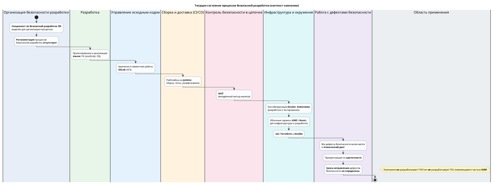

# Блок-схема DevSecOps-процесса (текущее состояние)

Диаграмма соответствует контексту компании: выделенный специалист по безопасной разработке при отсутствии регламента; стек C#, JavaScript, SQL; GitLab + Jenkins; SAST; Docker/Kubernetes; облако (AWS/Azure); Terraform и Ansible; дефекты безопасности уходят в технический долг с приоритетом по критичности без фиксированных сроков устранения; не ГИС и не ПО в составе КИИ.

Для получения изображения: откройте блок в [PlantUML](https://plantuml.com/) или используйте расширение PlantUML в IDE / `plantuml` CLI.
