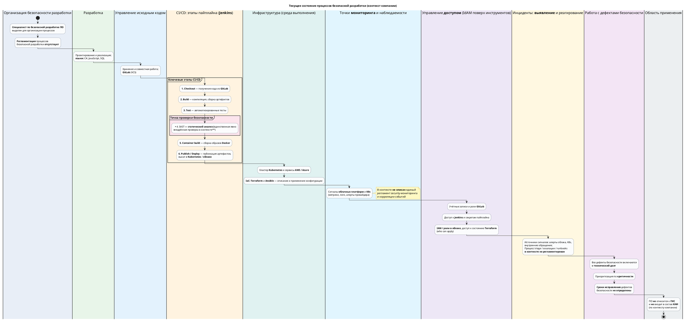

# Блок-схема DevSecOps-процесса (текущее состояние)

Диаграмма соответствует контексту компании: выделенный специалист по безопасной разработке при отсутствии регламента; стек C#, JavaScript, SQL; GitLab + Jenkins; SAST; Docker/Kubernetes; облако (AWS/Azure); Terraform и Ansible; дефекты безопасности уходят в технический долг с приоритетом по критичности без фиксированных сроков устранения; не ГИС и не ПО в составе КИИ.

На схеме **[явно отражено требование задания](zadanie.md)**:

- ключевые **этапы CI/CD** в Jenkins (от получения кода до выката);
- **точки внедрения проверок безопасности** (SAST в пайплайне) и **мониторинг** (наблюдаемость со стороны облака и Kubernetes — в контексте отдельный регламент не описан);
- **управление доступом** (GitLab, Jenkins, облако, IaC) и **выявление инцидентов** (в описании компании отдельный регламентированный процесс не приведён — на схеме это отмечено как текущий пробел).

Для получения изображения: откройте блок в [PlantUML](https://plantuml.com/) или используйте расширение PlantUML в IDE / `plantuml` CLI.
